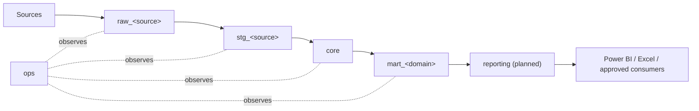

# GE Data Platform

One GE enterprise data platform integrating multiple operational and
financial source systems into governed, conformed business data for
reporting and analytics.

**This is not merely a telemetry warehouse.** It grew from one (the
predecessor `telemetry_etl` project), but the architecture -- `ge_warehouse`
-- is explicitly designed around any current or future GE source system,
telemetry or otherwise, conformed into one enterprise warehouse rather than
siloed by vendor. See `docs/architecture/platform-overview.md`.

## Source systems

| Source | Status |
|---|---|
| Trackunit / Manitou | IMPLEMENTED (running against the legacy database) |
| Sendem / MiX | IMPLEMENTED (running against the legacy database) |
| EzyTrack / Telematics Guru | IMPLEMENTED (running against the legacy database) |
| Accounts / Evolution | IMPLEMENTED (running against the legacy database) |
| FieldOps | PLANNED -- no pipeline exists yet |

Per-source detail (auth, retries, known limitations, schedule):
`docs/sources/`.

## Architecture



`ops` is the operational metadata/control plane running alongside the data
path -- pipeline run history, table-load outcomes, watermarks, data-quality
results, and alerts -- not a data layer itself. Full definitions:
`docs/architecture/data-layers.md`.

**Current implementation status** (see
`docs/architecture/platform-overview.md` for the complete table): the
schema layout above exists as real, validated structure in `ge_warehouse`
on the development machine (18 schemas, `core.dim_date`, `ops` metadata
tables, roles). **No source ingestion has been migrated into it yet** --
every job today still reads/writes the legacy `telemetry_warehouse`
database, described in `docs/migration/legacy-to-platform-migration.md`.

## Repository structure

```text
src/ge_data_platform/    installable package: config, common, sources/<source>, orchestration
sql/migrations/          new, independent ge_warehouse migration sequence
sql/legacy/               frozen telemetry_warehouse migrations (historical reference)
sql/validation/           read-only validation packs (both databases)
tests/                    pytest, organized per source + orchestration + platform
docs/                     see below
scripts/                  operational entry points (ge_warehouse setup, EzyTrack auth check)
```

## Documentation

| | |
|---|---|
| **Architecture** | [`docs/architecture/`](docs/architecture/) -- platform overview, data layers, database architecture, naming conventions, decision record |
| **Sources** | [`docs/sources/`](docs/sources/) -- one document per source system |
| **Warehouse** | [`docs/warehouse/`](docs/warehouse/) -- core model, marts, reporting layer, source mapping, `dim_date` |
| **Operations** | [`docs/operations/`](docs/operations/) -- pipeline operations, monitoring/alerting, retries/recovery, data quality |
| **Development** | [`docs/development/`](docs/development/) -- local setup, testing, migrations, contribution guide |
| **Migration** | [`docs/migration/legacy-to-platform-migration.md`](docs/migration/legacy-to-platform-migration.md) -- the full legacy -> platform plan and object inventory |
| **Security** | [`docs/security/secrets-and-access.md`](docs/security/secrets-and-access.md) |
| **Glossary** | [`docs/glossary.md`](docs/glossary.md) |
| **Power BI data dictionary** | [`docs/powerbi_reporting_data_dictionary.md`](docs/powerbi_reporting_data_dictionary.md) -- the live, legacy reporting layer, in full |

Every document distinguishes **IMPLEMENTED** / **PLANNED** / **DEFERRED** /
**LEGACY** explicitly -- see `docs/architecture/platform-overview.md` for
what each means.

## Development setup

```powershell
Set-Location <path to ge-data-platform>
python -m pip install -e . --no-deps
if (-not (Test-Path .env)) { Copy-Item .env.example .env }
```

Python 3.13, no virtual environment. Full setup, `.env` precedence, and
credential policy: `docs/development/local-setup.md` and
`docs/security/secrets-and-access.md`.

## Running tests

```powershell
python -m pytest
```

139 tests, mocked HTTP/SQL -- no live credentials required. Full breakdown,
CLI checks, and live smoke-test procedure: `docs/development/testing.md`.

## Running providers manually

```powershell
python -m ge_data_platform.sources.sendem.sync
python -m ge_data_platform.sources.ezytrack.sync
python -m ge_data_platform.sources.trackunit.daily_activity --rolling-days 2
python -m ge_data_platform.sources.trackunit.location --date <date>
python -m ge_data_platform.sources.evolution.project_reports
```

Recovery flags, retry behavior, and overlap protection:
`docs/operations/retries-and-recovery.md`.

## Setting up `ge_warehouse` locally

```powershell
python -m scripts.setup_ge_warehouse --all
```

Creates the database if missing, applies every `sql/migrations/*.sql` file,
and validates the result. Never touches `telemetry_warehouse`. Details:
`docs/development/migrations.md`.

## Migration status

`ge_warehouse` is a validated architecture baseline, running alongside
`telemetry_warehouse` on the same development Postgres instance. No
production system reads from or writes to it yet. Full plan and per-object
inventory: `docs/migration/legacy-to-platform-migration.md`.
