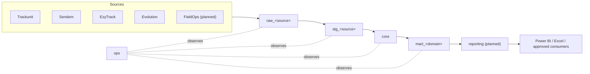

# Platform overview

**Status: mixed.** The architecture described here is real and partially
implemented; the source-code migration it will eventually host is not. See
`docs/architecture/data-layers.md` for the implemented/planned breakdown of
each layer, and `docs/migration/legacy-to-platform-migration.md` for the
cutover plan.

## Why this replaced a telemetry-centric architecture

The platform's predecessor (`telemetry_etl`, and its database
`telemetry_warehouse`) grew organically around three telemetry vendors --
Sendem, EzyTrack, Trackunit -- with a fourth, unrelated source (Accounts /
Evolution project-accounting data) added later into the same `raw` /
`staging` / `etl` schemas as an afterthought. That structure worked, and
still runs production today, but it has a naming and modeling problem: its
schemas are named for a *technical layer* (`raw`, `staging`) shared
indiscriminately by every source, with no schema boundary between "telemetry
data" and "accounting data," and no schema at all for a conformed,
cross-source business view. Adding a fifth source (FieldOps) or a finance
mart to that structure would mean either overloading the existing generic
schemas further or inventing ad hoc new ones with no consistent pattern.

`ge_warehouse` replaces that with a schema layout that scales by *source*
first (`raw_<source>`, `stg_<source>`) and then by *business domain*
(`mart_<domain>`), with one conformed layer (`core`) in between. See
`docs/architecture/data-layers.md` for the full definition of each layer.

## Why one enterprise warehouse, not separate telemetry/accounts warehouses

The alternative to widening `ge_warehouse` would have been standing up a
second warehouse purely for Accounts/Evolution (and a third, later, for
FieldOps). That was rejected: GE's business questions routinely cross these
boundaries -- a fleet utilization question needs Trackunit/Sendem/EzyTrack
telemetry; a project profitability question needs Evolution financial data
*and* the fleet activity that drove it. Splitting the warehouse by source
system would force that join to happen outside the warehouse, in Power BI or
by hand, for every such question. One warehouse with source-scoped raw/staging
layers underneath a single conformed `core` keeps that join inside the
platform, done once, correctly.

## Source system vs. business domain

This distinction is the single most important modeling idea in this
platform, and it is why the schema layout has two different naming axes.

A **source system** is where data comes from. It has no opinion about what
the business calls the data.

A **business domain** is what the business does with the data, regardless of
which source system it came from.

| Source system | Business domain(s) it feeds |
|---|---|
| Trackunit | Fleet |
| Sendem | Fleet |
| EzyTrack | Fleet |
| Evolution | Finance, Commercial, Procurement (accounting-driven domains) |
| FieldOps (planned) | Maintenance, Operations |

Concretely: **Evolution is a source system; Finance is a business domain.**
Evolution happens to be the current source for most finance-relevant data,
but `mart_finance` is not "the Evolution mart" -- it is whatever `core` facts
and dimensions the finance domain needs, however many source systems
eventually feed them. Likewise, **Trackunit is a source system; Fleet is a
business domain** fed today by three source systems (Trackunit, Sendem,
EzyTrack), not one.

This is why `raw_*`/`stg_*` are named after source systems (they are
inherently source-specific, by design -- see `docs/architecture/data-layers.md`)
while `mart_*` are named after business domains (they are inherently
cross-source, by design). Naming a mart after a source system, or a raw
schema after a business domain, would be a modeling error under this
architecture.

## Canonical architecture

`ops` is not a layer in the data path -- it is a control plane that runs
alongside every layer, recording what ran, when, and with what outcome. See
`docs/architecture/data-layers.md#ops`.

## Current implementation status

| Layer | Status |
|---|---|
| `raw_<source>` schemas | IMPLEMENTED (empty) |
| `stg_<source>` schemas | IMPLEMENTED (empty) |
| `core.dim_date` | IMPLEMENTED |
| `core` (everything else) | PLANNED |
| `mart_<domain>` schemas | IMPLEMENTED (empty) |
| `reporting` schema | PLANNED (does not exist) |
| `ops.pipeline_run` / `ops.table_load` | IMPLEMENTED and WIRED -- written by every `--target platform` run of Trackunit, Sendem, EzyTrack, Evolution Project Reports (see `ge_data_platform.common.audit`) |
| `ops.schema_version` | IMPLEMENTED and WIRED -- every applied migration registers itself |
| `ops.source_watermark` / `ops.data_quality_result` / `ops.alert_event` | IMPLEMENTED (structure only; not wired into any job) |
| Actual source ingestion into any of the above | NOT STARTED -- every provider job today still writes to legacy `telemetry_warehouse` |

The legacy stack (`telemetry_etl`'s successor code, `telemetry_warehouse`'s
`raw`/`staging`/`clean`/`etl`/`reporting` schemas) remains the only thing any
production job or Power BI report actually reads or writes. Everything
described above as IMPLEMENTED exists as real, tested database structure in
`ge_warehouse` on the development machine -- not yet as a running pipeline.

## Where to go next

- Layer definitions: `docs/architecture/data-layers.md`
- Every schema, what it contains today: `docs/architecture/database-architecture.md`
- Naming rules: `docs/architecture/naming-conventions.md`
- Why-we-decided-this record: `docs/architecture/architecture-decisions.md`
- Per-source detail: `docs/sources/`
- Migration plan: `docs/migration/legacy-to-platform-migration.md`
