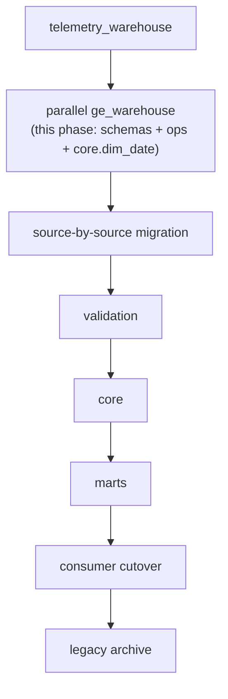

# Legacy-to-platform migration

This is the migration plan and the complete current -> target object
inventory for moving off `telemetry_warehouse` (LEGACY, live production)
onto `ge_warehouse` (the platform baseline described in
`docs/architecture/`). It supersedes and absorbs the standalone inventory
document written when `ge_warehouse`'s baseline was first created; that
content lives here now, kept current alongside the rest of the
documentation instead of drifting in a separate file.

**Status: planning + baseline only.** No row of application data has moved.
No provider job writes to `ge_warehouse`. `telemetry_warehouse` remains the
only database any running job or Power BI report actually uses.

## The principle

> **Nuke the old naming, not the data.**

Nothing about `telemetry_warehouse`'s actual historical data is being
discarded. What's being replaced is the *naming and schema structure*
(`raw`/`staging`/`etl` shared indiscriminately across sources) in favor of
the source-scoped, domain-scoped layout in `docs/architecture/data-layers.md`.
Every migration step below is additive to `ge_warehouse` and read-only
against `telemetry_warehouse` until an explicit, reviewed cutover step says
otherwise.

## Phase pipeline



| Phase | What happens | Status |
|---|---|---|
| `telemetry_warehouse` | Live production, unchanged throughout | ONGOING (LEGACY) |
| parallel `ge_warehouse` | Schemas, `ops` metadata structure, roles, `core.dim_date` | IMPLEMENTED (this phase) |
| source-by-source migration | Each source's ingestion ported to write `raw_<source>`/`stg_<source>` | NOT STARTED |
| validation | Row counts, spot checks, comparison queries between old and new for the same window | NOT STARTED (approach described in `docs/development/testing.md#side-by-side-migration-validation-philosophy`) |
| `core` | Cross-source conformance (`dim_asset` first, then facts) built on validated staging data | NOT STARTED -- blocked on source-map design, `docs/warehouse/source-mapping.md` |
| marts | `mart_<domain>` objects built on `core` | NOT STARTED |
| consumer cutover | Power BI/Excel/applications repointed from `telemetry_warehouse.reporting` to the new `reporting` schema | NOT STARTED |
| legacy archive | `telemetry_warehouse` retired/archived once every consumer has cut over | NOT STARTED |

## Intended source migration order

```text
Trackunit
Sendem
EzyTrack
Evolution
FieldOps
```

This order is **not yet formally chosen** by any decision recorded in
`docs/architecture/architecture-decisions.md` -- it is presented here as the
current working assumption, kept in the order the sources appear across
this documentation set, because no repository evidence (code, tests,
tickets) indicates a different order has been committed to. Revisit this
list, and record the actual decision as a new ADR, before starting Phase 4
(source-by-source migration) for real.

## Current -> target object inventory

Verified against `sql/legacy/telemetry_migrations/`, `sql/validation/`,
`src/ge_data_platform/common/database.py`, and a read-only inspection of the
live `telemetry_warehouse` catalog (schemas, tables, columns, views, row
counts) -- not inferred from filenames.

Legend for **Migration method**: `structural-only` (target schema exists,
no data moved yet); `deferred (conformance needed)` (needs the cross-source
identifier design in `docs/warehouse/source-mapping.md` first);
`deprecate` (no target -- superseded or dead); `rebuild-on-core` (the
object's *logic*, not its DDL, gets rebuilt once `core` exists under it).

### Raw layer

| Current | Target | Method | Notes |
|---|---|---|---|
| `raw.trackunit_assets` | `raw_trackunit.asset` | structural-only | 107 rows; re-fetchable from API |
| `raw.trackunit_aemp_operating_hour(s)` | `raw_trackunit.aemp_operating_hour` | structural-only | 125,031 rows; upstream retention limited, not fully re-fetchable |
| `raw.trackunit_aemp_moving_hours` | `raw_trackunit.aemp_moving_hour` | structural-only | 122,932 rows |
| `raw.trackunit_aemp_distance` | `raw_trackunit.aemp_distance` | structural-only | 122,933 rows |
| `raw.trackunit_aemp_locations` | `raw_trackunit.aemp_location` | structural-only | 28,501 rows; 48h re-fetch window only |
| `raw.trackunit_site_history` | `raw_trackunit.site_history` | structural-only | 39 rows; re-fetchable |
| `raw.trackunit_sites` | `raw_trackunit.site` | structural-only | 11 rows; enrichment-resolved subset only, not a full master |
| `raw.sendem_assets` | `raw_sendem.asset` | structural-only | 257 rows; re-fetchable |
| `raw.sendem_sites` | `raw_sendem.site` | structural-only | 168 rows |
| `raw.sendem_event_descriptions` | `raw_sendem.event_description` | structural-only | 114 rows |
| `raw.sendem_trips_assets_daily` | `raw_sendem.trip_daily` | structural-only | 1,906 rows; not re-fetchable (rolling API window) |
| `raw.sendem_events_assets_daily` | `raw_sendem.event_daily` | structural-only | 16,285 rows; not re-fetchable |
| `raw.ezytrack_assets` | `raw_ezytrack.asset` | structural-only | 51 rows |
| `raw.ezytrack_trips` | `raw_ezytrack.trip` | structural-only | 823 rows |
| `raw.evolution_project_reports` (defined; not yet applied on the local dev database) | `raw_evolution.project_report` | structural-only | Full-refresh source, always re-derivable from the live view |
| -- (no source exists) | `raw_fieldops.*` | structural-only (empty schema) | See `docs/sources/fieldops.md` |

### Staging layer

| Current | Target | Method | Notes |
|---|---|---|---|
| `staging.trackunit_dim_assets` | `stg_trackunit.asset` | structural-only | 107 rows |
| `staging.trackunit_daily_activity` | `stg_trackunit.daily_activity` | structural-only | 856 rows; must carry `counter_reset_detected`/`data_quality_status` forward explicitly |
| `staging.trackunit_location_enrichment` | `stg_trackunit.location_enrichment` | structural-only | 105 rows; address/zip/city/country stay NULL (V1) |
| `staging.sendem_dim_assets` / `_dim_sites` / `_dim_event_types` | `stg_sendem.asset` / `.site` / `.event_type` | structural-only | 257 / 168 / 120 rows |
| `staging.sendem_fact_trips_daily` / `_fact_events_daily` | `stg_sendem.trip_daily` / `.event_daily` | structural-only | 1,906 / 16,285 rows |
| `staging.ezytrack_dim_assets` | `stg_ezytrack.asset` | structural-only | 51 rows |
| `staging.ezytrack_fact_trips` | `stg_ezytrack.trip` | structural-only | 823 rows |
| -- (no staging step today; `raw.evolution_project_reports` already carries `business_unit`) | `stg_evolution.project_report` | deferred | Would need a definition of what "cleaning" adds beyond what raw already does |

### Historical backfill (`clean` schema -- legacy, out of band)

| Current | Target | Method | Notes |
|---|---|---|---|
| `clean.sendem_dim_assets` / `_dim_sites` / `_dim_event_types` | `core.dim_asset` / `dim_site` (conformed) | deferred (conformance needed) | 257 / 165 / 114 rows; one-time historical, must not be silently dropped; predates the event-type-inference fix in `002_create_sendem_warehouse_views.sql` |
| `clean.sendem_fact_trips_daily` | `core.fact_trip` / `fact_asset_daily_activity` | deferred (conformance needed) | 12,016 rows; not re-fetchable from the API |
| `clean.sendem_fact_events_daily` | (event component of the above) | deferred (conformance needed) | 111,122 rows; not re-fetchable |

### Legacy `warehouse` schema (dead)

Confirmed empty in the live catalog (defined by
`002_create_sendem_warehouse_views.sql`, superseded by `reporting` before
ever being dropped or used). Method: **deprecate** -- no target object.

### Reporting layer

| Current | Target | Method |
|---|---|---|
| `reporting.vw_trackunit_daily_activity`, `vw_sendem_trips_daily`, `vw_sendem_events_daily`, `vw_ezytrack_trips`, `vw_ezytrack_trip_report` | `mart_fleet.*` (future) | rebuild-on-core |
| `reporting.vw_assets_all` | `core.dim_asset` | deferred (conformance needed) -- this view *is* the asset-conformance problem, see `docs/warehouse/source-mapping.md` |
| `reporting.vw_daily_activity_all` | `mart_fleet.*` (future) | deferred (conformance needed) |
| `reporting.vw_provider_sync_health` | a future view over `ops.pipeline_run` | rebuild-on-core |
| `reporting.vw_sendem_dim_*_combined` (internal helpers) | -- | deprecate once `core` dims exist |

Full column-level detail for every current `reporting.*` object:
`docs/powerbi_reporting_data_dictionary.md`.

### Ops metadata

| Current | Target | Method | Notes |
|---|---|---|---|
| `etl.sync_runs` | `ops.pipeline_run` | structural-only (this phase) | 55 rows; `sync_run_id` -> `pipeline_run_id` (table itself renamed) |
| `etl.sync_table_loads` | `ops.table_load` | structural-only (this phase) | 299 rows; `id` -> `table_load_id`, `sync_run_id` -> `pipeline_run_id`, `provider` -> `source_system` (deliberate consistency fix) |

Full column mapping: `docs/architecture/architecture-decisions.md#adr-005`.

### Roles

| Current | Target | Method |
|---|---|---|
| `excel_reader` (grants SELECT on `telemetry_warehouse.reporting`) | `ge_bi_readonly` | structural-only -- new role, not a rename; `excel_reader` stays as-is on the legacy database |
| `postgres` (superuser; every job connects as this user today) | `ge_platform_admin` (admin) + `ge_etl` (writer) | structural-only -- today's ETL has no dedicated non-superuser login, flagged as a follow-up hardening item, not fixed by this phase |

## Bootstrapping an empty legacy `telemetry_warehouse`

Not the normal case (production already has most legacy migrations
applied), but if ever needed: a blind numeric-order runner is insufficient
because `022_create_reporting_powerbi_views.sql` depends on objects created
by `025_create_trackunit_location_enrichment.sql` and on the legacy
`clean.sendem_*` tables, both out of numeric order. Required sequence:

```powershell
psql -X -v ON_ERROR_STOP=1 -d telemetry_warehouse -f .\sql\legacy\telemetry_migrations\001_create_sendem_schema.sql
psql -X -v ON_ERROR_STOP=1 -d telemetry_warehouse -c 'CREATE SCHEMA IF NOT EXISTS clean;'
psql -X -v ON_ERROR_STOP=1 -d telemetry_warehouse -f .\sql\legacy\telemetry_migrations\sendem_tables.sql
psql -X -v ON_ERROR_STOP=1 -d telemetry_warehouse -f .\sql\legacy\telemetry_migrations\002_create_sendem_warehouse_views.sql
psql -X -v ON_ERROR_STOP=1 -d telemetry_warehouse -f .\sql\legacy\telemetry_migrations\004_create_etl_sync_table_loads.sql
psql -X -v ON_ERROR_STOP=1 -d telemetry_warehouse -f .\sql\legacy\telemetry_migrations\010_create_ezytrack_schema.sql
psql -X -v ON_ERROR_STOP=1 -d telemetry_warehouse -f .\sql\legacy\telemetry_migrations\020_create_trackunit_schema.sql
psql -X -v ON_ERROR_STOP=1 -d telemetry_warehouse -f .\sql\legacy\telemetry_migrations\025_create_trackunit_location_enrichment.sql
psql -X -v ON_ERROR_STOP=1 -d telemetry_warehouse -f .\sql\legacy\telemetry_migrations\022_create_reporting_powerbi_views.sql
psql -X -v ON_ERROR_STOP=1 -d telemetry_warehouse -f .\sql\legacy\telemetry_migrations\027_add_trackunit_counter_quality.sql
psql -X -v ON_ERROR_STOP=1 -d telemetry_warehouse -f .\sql\legacy\telemetry_migrations\028_add_sync_run_abandoned_support.sql
```

## What this phase intentionally did not do

- No row of application data copied from `telemetry_warehouse` into
  `ge_warehouse`.
- No `core` object except `core.dim_date`.
- No `core.*_source_map` table (pattern chosen, not built -- see
  `docs/warehouse/source-mapping.md`).
- No object in any `mart_*` schema.
- Dagster not repointed at `ge_warehouse`; no schedule/sensor change.
- No PostgreSQL schema in `telemetry_warehouse` renamed, altered, or
  dropped.
