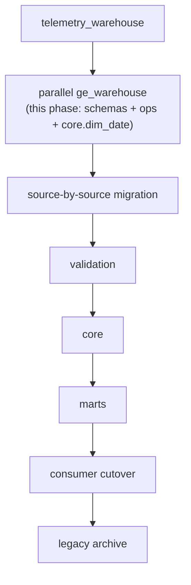

# Legacy-to-platform migration

This is the migration plan and the complete current -> target object
inventory for moving off `telemetry_warehouse` (LEGACY, live production)
onto `ge_warehouse` (the platform baseline described in
`docs/architecture/`). It supersedes and absorbs the standalone inventory
document written when `ge_warehouse`'s baseline was first created; that
content lives here now, kept current alongside the rest of the
documentation instead of drifting in a separate file.

**Status: baseline + Trackunit + Sendem + EzyTrack + Evolution raw/staging
migrated and validated.** Trackunit's, Sendem's, and EzyTrack's historical
`raw`/`staging` data have been migrated into `raw_trackunit`/`stg_trackunit`,
`raw_sendem`/`stg_sendem`, and `raw_ezytrack`/`stg_ezytrack` in
`ge_warehouse`, with full reconciliation against `telemetry_warehouse` and a
real fresh-ingestion test for each. Evolution Project Reports is different in
kind: `telemetry_warehouse` has never actually held any Evolution data (see
below), so this was a **first platform load**, not a historical migration --
`raw_evolution.project_report`/`stg_evolution.project_report` were populated
directly from a live, read-only Evolution SQL Server extraction, reconciled
against that exact extracted batch. See
[Trackunit migration (completed)](#trackunit-migration-completed),
[Sendem migration (completed)](#sendem-migration-completed),
[EzyTrack migration (completed)](#ezytrack-migration-completed), and
[Evolution migration (completed)](#evolution-migration-completed) below.
FieldOps has not moved. No Dagster schedule writes to `ge_warehouse` --
`telemetry_warehouse` remains the only database any *scheduled* job or Power
BI report actually uses; all four migrated sources' platform-target code
paths exist but are exercised only by manual invocation.

## The principle

> **Nuke the old naming, not the data.**

Nothing about `telemetry_warehouse`'s actual historical data is being
discarded. What's being replaced is the *naming and schema structure*
(`raw`/`staging`/`etl` shared indiscriminately across sources) in favor of
the source-scoped, domain-scoped layout in `docs/architecture/data-layers.md`.
Every migration step below is additive to `ge_warehouse` and read-only
against `telemetry_warehouse` until an explicit, reviewed cutover step says
otherwise.

## Phase pipeline



| Phase | What happens | Status |
|---|---|---|
| `telemetry_warehouse` | Live production, unchanged throughout | ONGOING (LEGACY) |
| parallel `ge_warehouse` | Schemas, `ops` metadata structure, roles, `core.dim_date` | IMPLEMENTED |
| source-by-source migration | Each source's ingestion ported to write `raw_<source>`/`stg_<source>` | IN PROGRESS -- Trackunit, Sendem, EzyTrack, and Evolution done (raw/staging only); FieldOps NOT STARTED |
| validation | Row counts, spot checks, comparison queries between old and new for the same window | DONE for Trackunit (`scripts/validate_trackunit_migration.py`), Sendem (`scripts/validate_sendem_migration.py`), EzyTrack (`scripts/validate_ezytrack_migration.py`), and Evolution (`scripts/validate_evolution_migration.py`, against the exact extracted batch -- see below); NOT STARTED for FieldOps |
| `core` | Cross-source conformance (`dim_asset` first, then facts) built on validated staging data | NOT STARTED -- blocked on source-map design, `docs/warehouse/source-mapping.md` |
| marts | `mart_<domain>` objects built on `core` | NOT STARTED |
| consumer cutover | Power BI/Excel/applications repointed from `telemetry_warehouse.reporting` to the new `reporting` schema | NOT STARTED |
| legacy archive | `telemetry_warehouse` retired/archived once every consumer has cut over | NOT STARTED |

## Intended source migration order

```text
Trackunit
Sendem
EzyTrack
Evolution
FieldOps
```

This order is **not yet formally chosen** by any decision recorded in
`docs/architecture/architecture-decisions.md` -- it is presented here as the
current working assumption, kept in the order the sources appear across
this documentation set, because no repository evidence (code, tests,
tickets) indicates a different order has been committed to. Revisit this
list, and record the actual decision as a new ADR, before starting Phase 4
(source-by-source migration) for real.

## Current -> target object inventory

Verified against `sql/legacy/telemetry_migrations/`, `sql/validation/`,
`src/ge_data_platform/common/database.py`, and a read-only inspection of the
live `telemetry_warehouse` catalog (schemas, tables, columns, views, row
counts) -- not inferred from filenames.

Legend for **Migration method**: `structural-only` (target schema exists,
no data moved yet); `deferred (conformance needed)` (needs the cross-source
identifier design in `docs/warehouse/source-mapping.md` first);
`deprecate` (no target -- superseded or dead); `rebuild-on-core` (the
object's *logic*, not its DDL, gets rebuilt once `core` exists under it).

### Raw layer

| Current | Target | Method | Notes |
|---|---|---|---|
| `raw.trackunit_assets` | `raw_trackunit.asset` | **migrated + validated** | 107 rows |
| `raw.trackunit_aemp_operating_hour(s)` | `raw_trackunit.aemp_operating_hour` | **migrated + validated** | 125,031 historical rows (+ live rows from fresh-ingestion testing) |
| `raw.trackunit_aemp_moving_hours` | `raw_trackunit.aemp_moving_hour` | **migrated + validated** | 122,932 historical rows |
| `raw.trackunit_aemp_distance` | `raw_trackunit.aemp_distance` | **migrated + validated** | 122,933 historical rows |
| `raw.trackunit_aemp_locations` | `raw_trackunit.aemp_location` | **migrated + validated** | 28,501 rows |
| `raw.trackunit_site_history` | `raw_trackunit.site_history` | **migrated + validated** | 39 rows |
| `raw.trackunit_sites` | `raw_trackunit.site` | **migrated + validated** | 11 rows |
| `raw.sendem_assets` | `raw_sendem.asset` | **migrated + validated** | 257 rows (+1 from live-ingestion testing); re-fetchable |
| `raw.sendem_sites` | `raw_sendem.site` | **migrated + validated** | 168 rows |
| `raw.sendem_event_descriptions` | `raw_sendem.event_description` | **migrated + validated** | 114 rows |
| `raw.sendem_trips_assets_daily` | `raw_sendem.trip_daily` | **migrated + validated** | 1,906 historical rows (+ live rows from fresh-ingestion testing); not re-fetchable (rolling API window) -- no `clean.*` history (raw-shaped only, see below) |
| `raw.sendem_events_assets_daily` | `raw_sendem.event_daily` | **migrated + validated** | 16,285 historical rows (+ live rows from fresh-ingestion testing); not re-fetchable |
| `raw.ezytrack_assets` | `raw_ezytrack.asset` | **migrated + validated** | 51 historical rows (+4 from live-ingestion testing) |
| `raw.ezytrack_trips` | `raw_ezytrack.trip` | **migrated + validated** | 823 historical rows (+25 from live-ingestion testing) |
| -- (`raw.evolution_project_reports` was defined by `telemetry_migrations/029` but confirmed **never applied** -- no legacy data exists) | `raw_evolution.project_report` | **first platform load + validated** | 29,948 rows (GE 21,582 + TLS 8,366) at load time; full-refresh source, always re-derivable from the live view. `id` is a transaction-type code (11 values), not a row key -- surrogate `project_report_id` PK, no natural key. See [Evolution migration (completed)](#evolution-migration-completed). |
| -- (no source exists) | `raw_fieldops.*` | structural-only (empty schema) | See `docs/sources/fieldops.md` |

### Staging layer

| Current | Target | Method | Notes |
|---|---|---|---|
| `staging.trackunit_dim_assets` | `stg_trackunit.asset` | **migrated + validated** | 107 rows |
| `staging.trackunit_daily_activity` | `stg_trackunit.daily_activity` | **migrated + validated, with a documented correction** | 856 historical rows; 230 carry a corrected `counter_reset_detected`/`data_quality_status` the legacy row never had -- see [Trackunit migration (completed)](#trackunit-migration-completed) |
| `staging.trackunit_location_enrichment` | `stg_trackunit.location_enrichment` | **migrated + validated** | 105 rows; address/zip/city/country stay NULL (V1) |
| `staging.sendem_dim_assets` / `_dim_sites` / `_dim_event_types` | `stg_sendem.asset` / `.site` / `.event_type` | **migrated + validated** | 257 / 168 / 120 rows (+2 inferred placeholder event types, see below) |
| `staging.sendem_fact_trips_daily` / `_fact_events_daily` | `stg_sendem.trip_daily` / `.event_daily` | **migrated + validated, with legacy `clean.*` history folded in** | 1,906 / 16,285 rolling-window rows + 11,439 / 106,188 exclusive historical rows from `clean.*` -- see [Sendem migration (completed)](#sendem-migration-completed) |
| `staging.ezytrack_dim_assets` | `stg_ezytrack.asset` | **migrated + validated** | 51 historical rows (+4 from live-ingestion testing) |
| `staging.ezytrack_fact_trips` | `stg_ezytrack.trip` | **migrated + validated** | 823 historical rows (+25 from live-ingestion testing) |
| -- (no legacy staging step; legacy `raw.evolution_project_reports` blurred raw+business_unit into one table, and was never populated anyway) | `stg_evolution.project_report` | **first platform load + validated** | 29,948 rows; same rows as `raw_evolution.project_report` plus `business_unit` (the one derived column the pipeline computes) -- see [Evolution migration (completed)](#evolution-migration-completed) |

### Historical backfill (`clean` schema -- legacy, out of band)

| Current | Target | Method | Notes |
|---|---|---|---|
| `clean.sendem_dim_assets` / `_dim_sites` / `_dim_event_types` | -- (not separately migrated) | **investigated -- confirmed redundant** | 257 / 165 / 114 rows; key-set diff against `staging.sendem_dim_*` found **zero** ids exclusive to `clean` (0/0/0) -- proper subsets of current staging dims, carrying no unique master-data value. See [Sendem migration (completed)](#sendem-migration-completed). |
| `clean.sendem_fact_trips_daily` | `stg_sendem.trip_daily` | **migrated + validated** | 12,016 rows (2026-01-01 to 2026-06-30); not re-fetchable from the API. 11,439 exclusive keys folded in; 577 overlapping keys resolved in favor of `staging`'s live-pipeline value (float-precision drift only, not a business difference). No `core` conformance needed -- this is staging-grade, already-enriched data, folded straight into `stg_sendem`. |
| `clean.sendem_fact_events_daily` | `stg_sendem.event_daily` | **migrated + validated** | 111,122 rows; not re-fetchable. 106,188 exclusive keys folded in; 4,934 overlapping keys resolved the same way. 2 `event_type_id`s (41 rows) referenced by no dimension anywhere were resolved with inferred "Unknown Sendem Event Type" placeholder rows. |

**Note on `core` conformance:** the original assumption in this table (when
only Trackunit had been investigated) was that `clean.*`'s history would
need `core.dim_asset`/`core.fact_trip` conformance before it could be
preserved. The actual Sendem investigation found this unnecessary: `clean.*`
is shape-identical to `staging.sendem_fact_*_daily` (same grain, same
enrichment, an added `source_system` column) with no cross-source
conformance to do -- it is single-source, staging-grade data, not derived
business data, so it belongs in `stg_sendem` directly. `core`/`mart_*` are
still not built in this phase (see "What this phase intentionally did not
do" below).

### Legacy `warehouse` schema (dead)

Confirmed empty in the live catalog (defined by
`002_create_sendem_warehouse_views.sql`, superseded by `reporting` before
ever being dropped or used). Method: **deprecate** -- no target object.

### Reporting layer

| Current | Target | Method |
|---|---|---|
| `reporting.vw_trackunit_daily_activity`, `vw_sendem_trips_daily`, `vw_sendem_events_daily`, `vw_ezytrack_trips`, `vw_ezytrack_trip_report` | `mart_fleet.*` (future) | rebuild-on-core |
| `reporting.vw_assets_all` | `core.dim_asset` | deferred (conformance needed) -- this view *is* the asset-conformance problem, see `docs/warehouse/source-mapping.md` |
| `reporting.vw_daily_activity_all` | `mart_fleet.*` (future) | deferred (conformance needed) |
| `reporting.vw_provider_sync_health` | a future view over `ops.pipeline_run` | rebuild-on-core |
| `reporting.vw_sendem_dim_*_combined` (internal helpers) | -- | deprecate once `core` dims exist |

Full column-level detail for every current `reporting.*` object:
`docs/powerbi_reporting_data_dictionary.md`.

### Ops metadata

| Current | Target | Method | Notes |
|---|---|---|---|
| `etl.sync_runs` | `ops.pipeline_run` | structural-only (this phase) | 55 rows; `sync_run_id` -> `pipeline_run_id` (table itself renamed) |
| `etl.sync_table_loads` | `ops.table_load` | structural-only (this phase) | 299 rows; `id` -> `table_load_id`, `sync_run_id` -> `pipeline_run_id`, `provider` -> `source_system` (deliberate consistency fix) |

Full column mapping: `docs/architecture/architecture-decisions.md#adr-005`.

### Roles

| Current | Target | Method |
|---|---|---|
| `excel_reader` (grants SELECT on `telemetry_warehouse.reporting`) | `ge_bi_readonly` | structural-only -- new role, not a rename; `excel_reader` stays as-is on the legacy database |
| `postgres` (superuser; every job connects as this user today) | `ge_platform_admin` (admin) + `ge_etl` (writer) | structural-only -- today's ETL has no dedicated non-superuser login, flagged as a follow-up hardening item, not fixed by this phase |

## Bootstrapping an empty legacy `telemetry_warehouse`

Not the normal case (production already has most legacy migrations
applied), but if ever needed: a blind numeric-order runner is insufficient
because `022_create_reporting_powerbi_views.sql` depends on objects created
by `025_create_trackunit_location_enrichment.sql` and on the legacy
`clean.sendem_*` tables, both out of numeric order. Required sequence:

```powershell
psql -X -v ON_ERROR_STOP=1 -d telemetry_warehouse -f .\sql\legacy\telemetry_migrations\001_create_sendem_schema.sql
psql -X -v ON_ERROR_STOP=1 -d telemetry_warehouse -c 'CREATE SCHEMA IF NOT EXISTS clean;'
psql -X -v ON_ERROR_STOP=1 -d telemetry_warehouse -f .\sql\legacy\telemetry_migrations\sendem_tables.sql
psql -X -v ON_ERROR_STOP=1 -d telemetry_warehouse -f .\sql\legacy\telemetry_migrations\002_create_sendem_warehouse_views.sql
psql -X -v ON_ERROR_STOP=1 -d telemetry_warehouse -f .\sql\legacy\telemetry_migrations\004_create_etl_sync_table_loads.sql
psql -X -v ON_ERROR_STOP=1 -d telemetry_warehouse -f .\sql\legacy\telemetry_migrations\010_create_ezytrack_schema.sql
psql -X -v ON_ERROR_STOP=1 -d telemetry_warehouse -f .\sql\legacy\telemetry_migrations\020_create_trackunit_schema.sql
psql -X -v ON_ERROR_STOP=1 -d telemetry_warehouse -f .\sql\legacy\telemetry_migrations\025_create_trackunit_location_enrichment.sql
psql -X -v ON_ERROR_STOP=1 -d telemetry_warehouse -f .\sql\legacy\telemetry_migrations\022_create_reporting_powerbi_views.sql
psql -X -v ON_ERROR_STOP=1 -d telemetry_warehouse -f .\sql\legacy\telemetry_migrations\027_add_trackunit_counter_quality.sql
psql -X -v ON_ERROR_STOP=1 -d telemetry_warehouse -f .\sql\legacy\telemetry_migrations\028_add_sync_run_abandoned_support.sql
```

## Trackunit migration (completed)

The first real source migration: `raw.trackunit_*`/`staging.trackunit_*` ->
`raw_trackunit.*`/`stg_trackunit.*` in `ge_warehouse`. `core`/`mart_fleet`
were deliberately **not** touched -- this phase stops at staging.

### Legacy objects found (inventory, before any DDL)

Verified against the live `telemetry_warehouse` catalog: 7 `raw.trackunit_*`
tables, 3 `staging.trackunit_*` tables, 1 `reporting.vw_trackunit_daily_activity`
view (untouched by this migration). No object beyond this list exists. Exact
row counts, keys, constraints, and indexes were inventoried before writing
any migration -- see the object tables above for the mapping and counts.

### New objects created

`sql/migrations/005_create_raw_trackunit.sql` (7 tables) and
`006_create_stg_trackunit.sql` (3 tables), applied via
`python -m scripts.setup_ge_warehouse --migrate`. Table names drop the
redundant `trackunit_` prefix (the schema already identifies the source);
column shapes are otherwise unchanged, with one addition:
`stg_trackunit.daily_activity` includes `counter_reset_detected`/
`data_quality_status` as first-class, enforced (`NOT NULL`, defaulted,
`CHECK`-constrained) columns from creation -- legacy never actually got
these (see below).

### A discovered gap, and how it was handled

`027_add_trackunit_counter_quality.sql` was written to add and backfill
`counter_reset_detected`/`data_quality_status` on legacy
`staging.trackunit_daily_activity`, but was **never actually applied** to
this local `telemetry_warehouse` -- confirmed by catalog inspection (no such
columns exist) and by finding 238 (asset, report_date) pairs in the raw AEMP
series with a genuine mid-day counter decrease that legacy's stored derived
metric does not reflect. Since `telemetry_warehouse` is read-only for this
work, 027 could not be run there. Instead,
`scripts/backfill_trackunit_historical.py` copies every other column from
the legacy row unchanged, then applies 027's exact detection logic while
writing into `ge_warehouse` -- so `stg_trackunit.daily_activity` starts from
the corrected state 027 always intended, not a copy of the gap.

### Historical backfill and reconciliation results

`scripts/backfill_trackunit_historical.py` (local-only, read-only against
`telemetry_warehouse`, `INSERT ... ON CONFLICT DO NOTHING`, restart-safe)
copied all 7 raw tables and 3 staging tables. `scripts/validate_trackunit_migration.py`
independently reconciles both databases object-by-object (row counts, key
parity, date/time coverage, null profiles, numeric sums, location-enrichment
status distribution, and -- for `daily_activity` -- an independent
recomputation of the expected counter-reset set, not trust in the backfill's
own bookkeeping):

```text
TRACKUNIT HISTORICAL MIGRATION VALIDATION

raw_trackunit.asset                  PASS
raw_trackunit.aemp_operating_hour    PASS
raw_trackunit.aemp_moving_hour       PASS
raw_trackunit.aemp_distance          PASS
raw_trackunit.aemp_location          PASS
raw_trackunit.site_history           PASS
raw_trackunit.site                   PASS
stg_trackunit.asset                  PASS
stg_trackunit.daily_activity         PASS
stg_trackunit.location_enrichment    PASS

Overall: PASS
```

Exact-equality checks (row counts, keys, numeric sums, null profiles,
date/time coverage) passed with **zero tolerance** everywhere except the 230
`stg_trackunit.daily_activity` rows with a documented, independently-verified
counter reset -- for those, the check is that the new value is correctly
`NULL`/flagged, not that it matches the stale legacy value.

Re-running the backfill script a second time (idempotency test) inserted
`0` new rows into every table (`read N, inserted 0` for all 10 objects) and
left the quality distribution (230 `COUNTER_RESET` / 626 `live`) unchanged;
re-running the full reconciliation afterward still reports `Overall: PASS`.

### Fresh-ingestion test

After historical parity passed, `daily_activity.py`/`location.py` were
adapted (not forked -- see `docs/sources/trackunit.md#ge_warehouse-platform-target`)
to support `--target platform`, then run live once:

```powershell
python -m ge_data_platform.sources.trackunit.daily_activity --date 2026-08-12 --limit 3 --target platform
```

against `ge_warehouse` / `raw_trackunit` + `stg_trackunit`, with no Dagster
schedule involved. Result: 3 assets, 471 raw metric points, 3
`stg_trackunit.daily_activity` rows written -- including one genuine,
live-detected counter reset (asset `3849`: `active_driving_minutes` nulled,
`data_quality_status='COUNTER_RESET'`). `telemetry_warehouse`'s own data
does not extend past 2026-08-02, so no legacy comparison is possible for
this window -- stated here rather than invented. Re-running the identical
command a second time produced the same row counts and the same business
values (only `loaded_at` audit timestamps advanced) -- confirming the
existing UPSERT semantics hold unchanged under the platform target.

### What was intentionally not done in the Trackunit phase

- `core.dim_asset`/`core.asset_source_map` -- not built (pattern documented,
  not implemented -- see `docs/warehouse/source-mapping.md`).
- `mart_fleet.*` -- not built.
- No Dagster schedule points at `ge_warehouse`; `--target platform` is
  manual-only.
- Legacy Trackunit code/tables were not removed or altered.
- `ops.pipeline_run`/`ops.table_load` are not written to for platform-target
  runs (sync tracking is skipped, not redirected).

## Sendem migration (completed)

The second real source migration: `raw.sendem_*`/`staging.sendem_*` ->
`raw_sendem.*`/`stg_sendem.*` in `ge_warehouse`, PLUS folding in legacy
`clean.sendem_fact_trips_daily`/`_events_daily` history that exists nowhere
else. `core`/`mart_fleet` were deliberately **not** touched -- this phase
stops at staging, same as Trackunit.

### Legacy objects found (inventory, before any DDL)

Verified against the live `telemetry_warehouse` catalog (read-only session):
5 `raw.sendem_*` tables, 5 `staging.sendem_*` tables, 5 `clean.sendem_*`
tables, 5 `reporting.vw_sendem_*` views (untouched by this migration), and
`warehouse.*` confirmed empty (dead, no target). No object beyond this list
exists. Row counts, keys (all single-column or composite `PRIMARY KEY`, no
extra `UNIQUE`/`FOREIGN KEY` constraints, matching the applied DDL exactly),
and indexes (each table's PK index only) were inventoried before writing any
migration -- see the object tables above for the full mapping and counts.

`clean.*` predates `raw_sendem.asset`/`stg_sendem.asset`'s `site_id` column
(confirmed absent from `clean.sendem_dim_assets`) and is already enriched
with site/asset attributes (fleet_number, registration_number, site_name,
etc.) -- i.e. staging-shaped, not raw-shaped. A key-set diff against current
`staging.sendem_dim_*` found it to be a strict subset on every dimension
(assets: 257/257 common, 0 exclusive either side; sites: 165 common, 0
`clean`-exclusive, 3 `staging`-exclusive; event types: 114 common, 0
`clean`-exclusive, 6 `staging`-exclusive) -- classified as **normalized
staging data, confirmed redundant on the dimension side**, with **genuine,
irreplaceable history on the fact side** (`clean.sendem_fact_trips_daily`/
`_events_daily`, 2026-01-01 to 2026-06-30, all 181 days present with no
gaps).

### New objects created

`sql/migrations/007_create_raw_sendem.sql` (5 tables) and
`008_create_stg_sendem.sql` (5 tables), applied via
`python -m scripts.setup_ge_warehouse --migrate`. Table names drop the
redundant `sendem_` prefix (the schema already identifies the source),
matching the Trackunit precedent; column shapes otherwise mirror the
*current* live `raw.sendem_*`/`staging.sendem_*` shape (not the older shape
`clean.*`/`sql/legacy/telemetry_migrations/sendem_tables.sql` used).

### How legacy `clean.*` history was handled

- **Dims (`clean.sendem_dim_assets`/`_dim_sites`/`_dim_event_types`): NOT
  copied.** Confirmed redundant by the key-set diff above -- copying them
  would add zero unique asset/site/event-type ids, and dims are
  current-state master data, not a time series, so there is no history to
  lose by skipping them.
- **Facts (`clean.sendem_fact_trips_daily`/`_events_daily`): migrated into
  `stg_sendem.trip_daily`/`event_daily`, not `raw_sendem`.** `clean.*` has
  no raw-shaped counterpart (it was never the API's raw response, already
  enriched at the point it was captured), so it has nothing to contribute to
  `raw_sendem`, which stays a faithful mirror of the current live
  `raw.sendem_*` rolling window only.
- **Overlap resolution:** `scripts/backfill_sendem_historical.py` loads
  legacy `staging` fact rows first, then merges `clean` rows via
  `INSERT ... ON CONFLICT (<pk>) DO NOTHING`. On the 577 trip / 4,934 event
  `(date_key, group_id, site_id, asset_id[, event_type_id])` keys present in
  *both* sources (the 2026-06-24..06-30 overlap window), `staging`'s
  live-pipeline value is kept; sampled differences were float-precision
  drift only (e.g. `112.7` vs `112.69999999999999`), never a business-content
  difference. Only `clean`'s 11,439 / 106,188 **exclusive** keys (2026-01-01
  to 2026-06-23) actually extend history.
- **Orphaned event types:** `clean.sendem_fact_events_daily` references 2
  `event_type_id`s (41 rows total) present in **no** dimension table
  anywhere -- not `raw`, not `clean`'s own dim, not current `staging`.
  `apply_inferred_event_types()` in the backfill script synthesizes the same
  `"Unknown Sendem Event Type"` / `event_category='unknown'` placeholder row
  `ge_data_platform.sources.sendem.transform.build_dim_event_types()`
  produces for this exact situation live, so no fact row is orphaned.

### Historical backfill and reconciliation results

`scripts/backfill_sendem_historical.py` (local-only, read-only against
`telemetry_warehouse`, `INSERT ... ON CONFLICT DO NOTHING`, restart-safe)
copied all 5 raw tables, all 5 staging tables, and merged both `clean.*`
fact tables. `scripts/validate_sendem_migration.py` independently
reconciles both databases object-by-object (row counts, key parity, null
profiles, numeric sums, date/time coverage, and -- for the two merged fact
tables -- an independent recomputation of `union(staging, clean)` plus a
row-by-row check that every `staging` key's *value* survived unchanged and
every `clean`-exclusive key's value survived unchanged):

```text
SENDEM HISTORICAL MIGRATION VALIDATION

raw_sendem.asset                                      PASS
raw_sendem.site                                       PASS
raw_sendem.event_description                          PASS
raw_sendem.trip_daily                                 PASS
raw_sendem.event_daily                                PASS
stg_sendem.asset                                       PASS
stg_sendem.site                                        PASS
stg_sendem.event_type                                  PASS
stg_sendem.trip_daily                                  PASS
stg_sendem.event_daily                                 PASS
clean.* dims (not migrated -- subset confirmation)      PASS

Overall: PASS
```

Every check passed with **zero tolerance** -- exact row counts, exact key
parity, exact numeric sums (`total_trip_distance_kilometres`,
`total_event_occurrences`), exact date/time coverage, and exact
row-for-row value equality on both the `staging`-wins overlap resolution and
the `clean`-exclusive historical rows. No discrepancy was hidden behind a
tolerance band anywhere.

Re-running the backfill script a second time (idempotency test) inserted
`0` new rows into every one of the 5 raw + 5 staging tables (`read N,
inserted 0` throughout, including the `clean` merge step and the inferred
event-type step reporting "No orphaned event_type_ids found"); re-running
the full reconciliation afterward still reported `Overall: PASS`.

### Fresh-ingestion test

After historical parity passed, `sync.py` was adapted (not forked -- see
`docs/sources/sendem.md#ge_warehouse-platform-target`) to support
`--target platform`, then run live once:

```powershell
python -m ge_data_platform.sources.sendem.sync --target platform --lookback-days 1
```

against `ge_warehouse` / `raw_sendem` + `stg_sendem`, window 20260812 to
20260813 (the smallest window `--lookback-days` supports), with no Dagster
schedule involved. Result: SUCCESS, 258 assets (1 new asset appeared live,
not present in the earlier snapshot -- real-world drift, not a defect), 92
trip rows and 1,166 event rows loaded into both `raw_sendem` and
`stg_sendem`. `telemetry_warehouse`'s own Sendem sync had not advanced past
2026-08-03 at the time of this test (confirmed by direct inspection), so no
legacy comparison is possible for the 2026-08-12/13 window -- stated here
rather than invented. Historical rows (2026-01-01 to 2026-08-03) were
confirmed unchanged and un-duplicated after the live run.

Re-running the identical command a second time produced the same row counts
(`raw_sendem.trip_daily` stayed at 1,998 total rows, `event_daily` at
17,451; `stg_sendem.trip_daily`/`event_daily` stayed at 13,437/123,639) and
the same business values (verified row-for-row on a sample) -- only
`loaded_at` audit timestamps advanced to the second run's single load
timestamp -- confirming the existing UPSERT semantics hold unchanged under
the platform target. `ops.pipeline_run`/`ops.table_load` stayed at 0 rows
across both runs (sync tracking is skipped, not redirected, for the
platform target).

### What was intentionally not done in the Sendem phase

- `core.dim_asset`/`core.asset_source_map` -- not built (clean.* facts
  needed no cross-source conformance to preserve -- see the "Note on `core`
  conformance" above).
- `mart_fleet.*` -- not built.
- No Dagster schedule points at `ge_warehouse`; `--target platform` is
  manual-only.
- Legacy Sendem code/tables were not removed or altered; `telemetry_warehouse.clean`
  itself is untouched (read-only source, not modified or dropped).
- `ops.pipeline_run`/`ops.table_load` are not written to for platform-target
  runs (sync tracking is skipped, not redirected).
- `reporting.vw_sendem_*` views were not touched or ported.

## EzyTrack migration (completed)

The third real source migration: `raw.ezytrack_*`/`staging.ezytrack_*` ->
`raw_ezytrack.*`/`stg_ezytrack.*` in `ge_warehouse`. `core`/`mart_fleet`
were deliberately **not** touched -- this phase stops at staging, same as
Trackunit and Sendem.

### Legacy objects found (inventory, before any DDL)

Verified against the live `telemetry_warehouse` catalog (read-only session,
independently confirmed local via `inet_server_addr()` = `::1`): 2
`raw.ezytrack_*` tables, 2 `staging.ezytrack_*` tables, 2
`reporting.vw_ezytrack_*` views (untouched by this migration). Unlike
Sendem, **no `clean.*` or other historical-only schema exists for
EzyTrack** -- confirmed by inspecting every schema in the live catalog (the
old prototype's `telematics` schema is confirmed fully retired, no trace
remains). `raw`+`staging` together are the complete legacy object set and
the sole authoritative history. Both assets and trips are persisted; no
duplicate `PRIMARY KEY`s; no orphan trip-to-asset references (0 rows).
Oldest history: asset `last_connected_utc` back to 2025-01-31; trip data
from 2026-06-25. Newest at inventory time: 2026-07-21 -- legacy had been
stalled for 3+ weeks, with `etl.sync_runs` showing repeated `FAILED` rows
(`GraphQL cost rate limit exceeded`) on every catch-up/reconciliation
attempt since.

### New objects created

`sql/migrations/009_create_raw_ezytrack.sql` (2 tables) and
`010_create_stg_ezytrack.sql` (2 tables), applied via
`python -m scripts.setup_ge_warehouse --migrate`. Table names drop the
redundant `ezytrack_` prefix; column shapes mirror the legacy tables 1:1 --
a straight structural port, no history-folding decision needed (unlike
Sendem's `clean.*`).

### A discovered gap, and how it was handled

Not a data gap this time, but a **shared-code safety gap**:
`PostgresLoader.get_last_successful_run` (which EzyTrack's catch-up logic
depends on to find its last successful window) unconditionally queried
`etl.sync_runs` regardless of `enable_sync_tracking`. `ge_warehouse` has no
`etl` schema at all, so an unguarded platform-target call would have either
crashed outright or -- had the schema coincidentally existed -- silently
misread legacy's 3-week-stale success cursor and attempted an unintended
`max_catchup_hours`-capped (168h) catch-up on the very first platform test.
Fixed at the source: `get_last_successful_run` now returns `None`
immediately whenever `enable_sync_tracking` is `False`, before any query is
issued. This makes a platform-target EzyTrack run behave as first-run/
explicit-window unconditionally -- the same shape `--reconcile` already
uses by design. Verified directly (an engine stub that raises if `connect()`
is ever called still returns `None` cleanly) and covered by a permanent
regression test. See `docs/operations/data-quality.md` for the full
narrative.

### Historical backfill and reconciliation results

`scripts/backfill_ezytrack_historical.py` (local-only, read-only against
`telemetry_warehouse`, `INSERT ... ON CONFLICT DO NOTHING`, restart-safe)
copied both raw tables and both staging tables in full.
`scripts/validate_ezytrack_migration.py` independently reconciles both
databases object-by-object (row counts, key parity, null profiles, numeric
sums, date/time coverage, distinct-asset counts, and an orphan-free join
check):

```text
EZYTRACK HISTORICAL MIGRATION VALIDATION

raw_ezytrack.asset    PASS
raw_ezytrack.trip     PASS
stg_ezytrack.asset    PASS
stg_ezytrack.trip     PASS

Overall: PASS
```

Every check passed with **zero tolerance** -- exact row counts, exact key
parity, exact numeric sums (`distance_meters`, `distance_km`,
`runtime_end_hrs`), exact date/time coverage, exact null-profile counts. No
discrepancy was hidden behind a tolerance band anywhere.

Re-running the backfill script a second time (idempotency test) inserted
`0` new rows into all 4 objects (`read N, inserted 0` throughout);
re-running the full reconciliation afterward still reported `Overall: PASS`.

### Fresh-ingestion test

After historical parity passed, `sync.py` was adapted (not forked) to
support `--target platform` plus an explicit `--lookback-hours` override
(needed precisely because of the catch-up-cursor gap above -- see
`docs/sources/ezytrack.md#ge_warehouse-platform-target`), then run live
once:

```powershell
python -m ge_data_platform.sources.ezytrack.sync --target platform --lookback-hours 1
```

against `ge_warehouse` / `raw_ezytrack` + `stg_ezytrack`, window
2026-08-13T11:41:42Z to 2026-08-13T12:41:42Z (first-run mode, confirmed no
catch-up cursor read), 1 chunk, page_size 50, with no Dagster schedule
involved. Result: SUCCESS, 55 assets (4 new, real-world drift since the
historical snapshot -- not a defect), 25 trips fetched in a single page (no
`hasNextPage`, no cursor to repeat, `max_pages` guard never approached), 0
duplicates, 0 orphan trip-to-asset references, all 823 historical trip rows
confirmed unchanged and un-duplicated after the load. No `RateLimitError`
or other quota event was encountered -- the small explicit window stayed
comfortably under the cost limit that had been failing legacy's larger
catch-up/reconciliation windows. `telemetry_warehouse`'s own EzyTrack sync
had not advanced past 2026-07-21 at the time of this test (confirmed by
direct inspection), so no legacy comparison is possible for the
2026-08-13 window -- stated here rather than invented.
`ops.pipeline_run`/`ops.table_load` stayed at 0 rows (sync tracking is
skipped, not redirected, for the platform target).

Re-running the identical window a second time (via `sync.run(target=
"platform", lookback_hours=1, now_utc=<the same fixed timestamp>)`, since
the CLI computes its window relative to wall-clock "now" and a fixed window
is required to prove idempotency) fetched the same 55 assets and 25 trips,
produced the same row counts (`raw_ezytrack.trip`/`stg_ezytrack.trip`
stayed at 848, `raw_ezytrack.asset`/`stg_ezytrack.asset` at 55) with zero
new duplicates -- only `loaded_at` audit timestamps advanced to the second
run's single load timestamp, confirming the existing UPSERT semantics hold
unchanged under the platform target.

### What was intentionally not done in the EzyTrack phase

- `core.dim_asset`/`core.asset_source_map` -- not built.
- `mart_fleet.*` -- not built.
- No Dagster schedule points at `ge_warehouse`; `--target platform` is
  manual-only.
- Legacy EzyTrack code/tables were not removed or altered.
- `ops.pipeline_run`/`ops.table_load` are not written to for platform-target
  runs (sync tracking is skipped, not redirected).
- `reporting.vw_ezytrack_*` views were not touched or ported.
- Provider quota was not intentionally exhausted to test failure handling --
  the existing cursor-repeat/max-page/rate-limit unit tests (already
  present before this migration) plus the new `get_last_successful_run`
  guard tests cover the catch-up-safety surface without a real multi-day
  provider pull.

## Evolution migration (completed)

The fourth source migration, and different in kind from the first three:
`telemetry_warehouse` has never actually held any Evolution data, so this is
a **FIRST PLATFORM LOAD**, not a historical migration. `core`/`mart_finance`
were deliberately **not** touched -- this phase stops at staging, same as
Trackunit, Sendem, and EzyTrack. Evolution is a source system, not a finance
architecture -- see `docs/sources/evolution.md`.

### Legacy objects found (inventory, before any DDL)

Verified against the live `telemetry_warehouse` catalog (read-only session,
independently confirmed local via `inet_server_addr()` = `::1`): **none**.
No `raw.evolution_*`, `staging.evolution_*`, or `accounts.*` object exists
anywhere. `sql/legacy/telemetry_migrations/029_create_accounts_evolution_project_reports_schema.sql`
is a real file in this repository, but its own `CREATE TABLE` was never
actually run here -- confirmed both by the catalog search finding nothing
and by `etl.sync_runs`: exactly 3 rows for `source_system =
'evolution_project_reports'`, all `FAILED`, all on 2026-08-12 (one
credential failure, two refused by the application's own pre-load
validation -- see "A discovered gap" below). No legacy row count, key set,
date range, or null profile exists to report because no legacy data exists.
Decision (per task section 2): **Migration mode: FIRST SOURCE LOAD.**

### Evolution SQL Server source confirmed

Read-only inspection (the same `SELECT`-only access the application's own
`ReadOnly` SQL login already uses -- see "A discovered gap" below) of
`dbo.vwProjectsReports` on both configured Evolution databases:

| | GE (`Ganthorpe Enterprises Live`) | TLS (`Total Loading Solutions Live`) |
|---|---|---|
| Row count at inspection | 21,582 | 8,362 |
| Row count at load time (~35 min later) | 21,582 | 8,366 |
| `DDate` range | 2025-01-31 .. 2026-11-30 | 2025-01-31 .. 2027-07-09 |
| Null `Id` | 0 | 0 |
| Null `ProjectCode` | 98 | 51 |
| Null `Customer` | 0 | 6,785 |

The row-count drift between inspection and load time (TLS +4) is real,
expected freshness variance in a live production accounting system, not a
defect -- exactly what task section 10 anticipated ("the live Evolution
database may change while testing"). `DDate` extending past "today"
(2026-08-13) is real source data, not a bug -- some rows represent
forward-dated/scheduled transactions; not reinterpreted here.

### A discovered gap, and how it was handled

Not a shared-code gap this time (EzyTrack's kind), but a **wrong source
assumption baked into the frozen legacy DDL and the still-current legacy
validation code** -- and the reason all 3 real legacy sync attempts have
ever failed:

`telemetry_migrations/029` and `ge_data_platform.common.database.
validate_combined_for_full_replace` both assume `Id` is a `BIGINT` row
identifier and that `(company, id)` is `dbo.vwProjectsReports`'s natural
primary key. Live read-only inspection of both GE and TLS databases
disproves this directly: `Id` is `VARCHAR`, takes only **11 distinct values
total** (`APTx`, `ARTx`, `CB`, `Crn`, `Grv`, `IJr`, `Inv`, `JL`, `OGrv`,
`Rts`, `SADJ`), and maps 1:1 to `Module` -- it is a transaction-type/module
code, not a per-row identifier. Even the widest practical composite key
(`id, cost_type, module, reference, d_date`) leaves 12,659 (GE) / 2,972
(TLS) duplicate rows; a `CHECKSUM`-based full-row comparison suggests
roughly 200 (GE) / 213 (TLS) rows are fully identical across every extracted
column. **`dbo.vwProjectsReports` has no reliable natural/business key at
the row grain.** This is exactly why the 2 non-credential legacy sync
attempts on 2026-08-12 both failed with "Refusing to replace
raw.evolution_project_reports: 29,130/29,137 row(s) share a duplicate
(company, id) key" -- the application's own existing safety check did
exactly its job and refused to load data it couldn't validate; nothing was
ever corrupted.

Handled by **not** touching the frozen legacy migration or the legacy
target's validation/DDL (both out of scope -- `telemetry_warehouse` stays
untouched, and the legacy Dagster job's behavior is unaffected), and instead
designing the new platform objects correctly from the start:
`raw_evolution.project_report`/`stg_evolution.project_report` use a
load-time surrogate `BIGSERIAL` primary key (`project_report_id`, not stable
across reloads, referenced by nothing) and enforce no uniqueness on the
source columns -- duplicate source rows are loaded as-is, never silently
deduplicated. A new, separate validation function,
`validate_project_report_batch_for_platform_load` (in the same module,
alongside the untouched legacy one), enforces only the assumptions the
source data actually supports (non-empty, `company` present and non-blank)
and explicitly allows duplicate `(company, id)` pairs. See
`sql/migrations/011_create_raw_evolution.sql` for the full evidence trail.
The three-run FAILED history in `etl.sync_runs` was left exactly as found --
`telemetry_warehouse` stays read-only.

Separately (much smaller): the first legacy failure was a login failure for
SQL user `'ReadOnly'` -- confirming the credential this application is
actually configured with is already a read-only-privileged login at the
database level, not just an application-level convention.

### First controlled load and reconciliation results

`scripts/run_evolution_first_load.py` performs the exact pipeline task
section 9 specifies (`Evolution SQL Server -> dbo.vwProjectsReports ->
Python extraction -> raw_evolution.project_report ->
stg_evolution.project_report`), using the real production functions
(`extract_all`, `build_raw`, `add_business_unit_classification`,
`PostgresLoader.replace_evolution_project_reports_platform`) -- not a
second implementation. Because the source can change mid-run, it captures
batch evidence (row counts, null profile, date bounds, exact `Decimal`
monetary aggregates, business_unit distribution) from the **exact extracted
DataFrames**, before any load happens. `scripts/validate_evolution_migration.py`
then reconciles `ge_warehouse` against that captured evidence -- not a fresh
Evolution re-query, which per task section 10 must never be allowed to
manufacture a false mismatch:

```text
EVOLUTION PROJECT REPORTS VALIDATION

source assumptions (no natural key; id is a type code, not a row id)  PASS
extracted batch internal consistency                                 PASS
raw_evolution.project_report row count                                PASS
raw_evolution.project_report per-company row count                    PASS
raw_evolution.project_report null(*)                                  PASS (8 columns)
raw_evolution.project_report sum(credit/debit/inclusive_amount/tax_amount)  PASS
raw_evolution.project_report date bounds                              PASS
raw_evolution.project_report surrogate key integrity                  PASS
stg_evolution.project_report row count                                PASS
stg_evolution.project_report per-company row count                    PASS
stg_evolution.project_report null(*)                                  PASS (8 columns)
stg_evolution.project_report sum(credit/debit/inclusive_amount/tax_amount)  PASS
stg_evolution.project_report date bounds                              PASS
stg_evolution.project_report business_unit distribution               PASS
stg_evolution.project_report surrogate key integrity                  PASS

Overall: PASS
```

Every monetary aggregate check used exact `Decimal` equality (`credit`
22,713,237.4354; `debit` 20,726,482.6609; `inclusive_amount`
17,691,387.9455; `tax_amount` 2,294,012.9400 -- combined GE+TLS) -- no
tolerance band anywhere. Load result: 29,948 rows into each of
`raw_evolution.project_report` and `stg_evolution.project_report` (GE
21,582 + TLS 8,366, matching the extracted batch exactly).

Re-running `scripts/run_evolution_first_load.py` a second time (idempotency
test) re-extracted from the still-unchanged live source and produced a
byte-identical batch (same row counts, same monetary aggregates, same
content fingerprint) to the first run; the full-replace load left both
tables at exactly 29,948 rows -- confirmed directly, not just inferred from
the load function's own return value -- with no growth or duplication.
Re-running `scripts/validate_evolution_migration.py` against the fresh
evidence still reported `Overall: PASS`.

### What was intentionally not done in the Evolution phase

- `core.dim_project`/`core.*_source_map` -- not built.
- `mart_finance.*` -- not built (Evolution is a source system, not "the
  finance mart" -- see `docs/sources/evolution.md`).
- No Dagster schedule points at `ge_warehouse`; `--target platform` is
  manual-only, same as the other three sources.
- The frozen legacy `telemetry_migrations/029` and legacy
  `validate_combined_for_full_replace`/`replace_accounts_evolution_project_reports`
  were left unmodified -- `telemetry_warehouse` and the legacy Dagster job
  are unaffected by this migration, including the wrong `(company, id)` key
  assumption discovered above.
- `ops.pipeline_run`/`ops.table_load` are not written to for platform-target
  runs (sync tracking is skipped, not redirected) -- same precedent as the
  other three sources.
- No second Evolution dataset (e.g. a future invoicing/GL extract) was
  started.
- Provider (SQL Server) writes: none. Every Evolution query issued during
  this migration was a plain `SELECT`; no `INSERT`/`UPDATE`/`DELETE`/`MERGE`/
  DDL was ever executed against Evolution.

## What this phase intentionally did not do

- No row of FieldOps application data copied from `telemetry_warehouse`
  into `ge_warehouse` (Trackunit, Sendem, EzyTrack, and Evolution are the
  four exceptions -- see above; Evolution had no legacy rows to copy in the
  first place, see [Evolution migration (completed)](#evolution-migration-completed)).
- No `core` object except `core.dim_date`.
- No `core.*_source_map` table (pattern chosen, not built -- see
  `docs/warehouse/source-mapping.md`).
- No object in any `mart_*` schema.
- Dagster not repointed at `ge_warehouse`; no schedule/sensor change.
- No PostgreSQL schema in `telemetry_warehouse` renamed, altered, or
  dropped.
